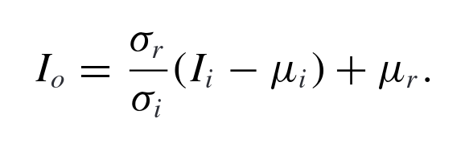

# Fast Color Transfer using Mean and Standard Deviation


## Introduction

Automated Color Transfer is the process of recoloring images by establishing a
mapping between a reference image and an input image. This project focuses on
Statistical Methods of Automated Color Transfer, specifically utilizing the CIE
L\*a\*b\* color space for per-channel color transfer.

Statistical Methods for Color Transfer rely on transferring the statistical
properties of the reference image to the input image. To do this we transform
the input image using information gained from the statistical properties of both
images.


In the histograms above we can see how the blue and green channels have shifted
from their position in the input histogram to more closely resemble the
reference histogram in the output image.

## Method

For this project we are implementing the method described in the paper
["Color transfer between images"](https://ieeexplore.ieee.org/abstract/document/946629)
by E. Reinhard, M. Adhikhmin, B. Gooch et al.

First we convert the color space of both the reference image and input image
into CIE L\*a\*b\* color space

```python
    reference = cv2.cvtColor(reference, cv2.COLOR_BGR2LAB).astype("float32")
    input = cv2.cvtColor(input, cv2.COLOR_BGR2LAB).astype("float32")
```

And split both the images into their respective l, a, b channels.

```python
    (l_ref, a_ref, b_ref) = cv2.split(reference)
    (l_in, a_in, b_in) = cv2.split(input)
```

Then we apply the transform shown below to each of the input channels
separately.



```python
    l_out = ((l_ref.std() / l_in.std()) * (l_in - l_in.mean())) + l_ref.mean()
    a_out = ((a_ref.std() / a_in.std()) * (a_in - a_in.mean())) + a_ref.mean()
    b_out = ((b_ref.std() / b_in.std()) * (b_in - b_in.mean())) + b_ref.mean()
```

We merge the channels we get from the transform to give us the output image.

```python
    output = cv2.merge([l_out, a_out, b_out])
```

And that's it we have an output image with a transferred palette.

##### Advantages:

- Easy to implement.
- Does not remove details / add artifacts.
- Very fast and very versatile for the amount of effort / compute being put in.

##### Disadvantages:

- Can often miss the mark on the reference palette.

#### Usage

To use on a local machine, simply clone the git repository and run the ipynb
with your ide of choice.

To use on google colab, upload the code and files from the repo into a folder in
your google drive and run the ipynb using google colab.

> Note that in either case you will have to edit the `base_path` variable to
> match your actual path

##### Other Details

- An additional `show_hist` function is defined to quickly show the histograms
  of the images in question. Uncomment its function call in the `showcase`
  function to see histograms of each image.

- A `rescale` function is called on the transform in the code to deal with the
  situation where the values in a channel go below `0` or above `255` after the
  transform. This an alternative to clipping values below `0` or above `255`.

## Examples


## References:

1.  [Color transfer between images](https://ieeexplore.ieee.org/abstract/document/946629):
    E. Reinhard, M. Adhikhmin, B. Gooch, P. Shirley.
2.  [Colour Mapping: A Review of Recent Methods, Extensions and Applications](https://onlinelibrary.wiley.com/doi/abs/10.1111/cgf.12671):
    H. Sheikh Faridul, T. Pouli, C. Chamaret et al.
3.  [CIE 15:2004. Colorimetry, 3rd edition](https://cie.co.at/publications/colorimetry-3rd-edition#:~:text=CIE%2015%3A2004%20Colorimetry%20represents,values%2C%20chromaticity%20coordinates%2C%20colour%20spaces)
